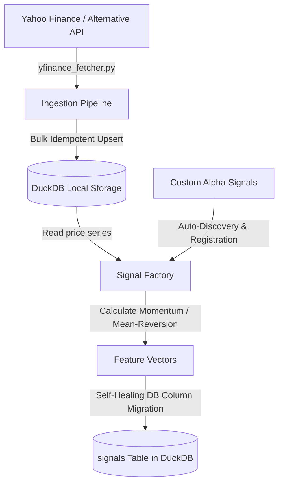

# Quantitative Research Platform Core

A highly modular, high-performance daily historical market data ingestion and feature engineering engine built for S&P 500 stocks. 
This platform uses **yfinance** for data sourcing and **DuckDB** for ultra-fast, local analytics-focused data storage. 

Features a strictly object-oriented, dynamic **Signal Factory** designed to easily plug in custom pricing and alpha signals with automatic schema migration.

---

## 🏗️ System Architecture



---

## ⚡ Key Technical Features

1. **Strictly Modular Sourcing**: 
   All fetchers implement `BaseFetcher` interface. Adding another ingestion source (e.g. Alpaca, Alpha Vantage, Interactive Brokers) requires writing only one class and requires zero changes to the database or storage pipelines.
   
2. **Local Analytical Powerhouse (DuckDB)**:
   Utilizes DuckDB's in-memory and local vectorized query engine to perform blistering fast bulk inserts, updates, and feature retrieval. Fully idempotent structure with composite Primary Keys `(symbol, date)`.
   
3. **Extendable 'Signal Factory'**:
   Utilizes Python reflection to automatically scan the `quant_platform/features/` directory and load any class subclassing `BaseSignal`. Simply drop in a new Python script to instantly incorporate your own alpha signals without altering existing code.
   
4. **Self-Healing Schema Migrations**:
   When new custom signals are created, the Signal Factory automatically scans the generated columns and updates the DuckDB database schema on-the-fly (`ALTER TABLE signals ADD COLUMN ...`), ensuring your feature store is always perfectly aligned.

---

## 🚀 Getting Started

### 1. Installation & Environment Setup

Clone this workspace and run:
```bash
# Initialize Python virtual environment
python3 -m venv .venv

# Activate the virtual environment
source .venv/bin/activate

# Install core quantitative packages
pip install -r requirements.txt
```

### 2. Sourcing Pricing & Volume Data

Run ingestion to fetch historical pricing and volume data.
```bash
# Option A: Fast Test Ingestion (runs on a representative S&P 500 subset of 15 tickers)
python -m quant_platform.main ingest --test

# Option B: Run custom list of tickers
python -m quant_platform.main ingest --tickers AAPL,MSFT,TSLA,NVDA,SPY --start-date 2023-01-01

# Option C: Run full S&P 500 Ingestion (dynamically parsed from Wikipedia)
python -m quant_platform.main ingest
```

### 3. Running Feature Engineering & Signal Generation

Run the **Signal Factory** to compute MACD, ROC, SMA Momentum, RSI, and Bollinger Bands.
```bash
# Calculate features for all ingested data and save to signals table
python -m quant_platform.main features
```

### 4. Database Diagnostics and Verification

Check the database health, total records, date ranges, and view calculated feature samples:
```bash
python -m quant_platform.main status
```

---

## 🛠️ Adding a Custom Alpha Signal

Adding a new custom signal is extremely easy. Simply create a new Python file under `quant_platform/features/` (e.g. `quant_platform/features/volatility.py`) and write a class that inherits from `BaseSignal`.

Here is a complete, copy-pasteable example of adding a **Custom Volatility Signal** (historical standard deviation ratio):

```python
# Save this in quant_platform/features/volatility.py
import pandas as pd
from quant_platform.features.base import BaseSignal

class VolatilitySignal(BaseSignal):
    """
    Computes custom close price volatility ratio over a rolling 21-day window.
    """
    
    @property
    def name(self) -> str:
        # Unique identifier used to track this group of signals
        return "custom_volatility"

    @property
    def required_columns(self) -> list[str]:
        # Only require the Close column from daily_prices
        return ["close"]

    def compute(self, data: pd.DataFrame) -> pd.DataFrame:
        # Data is sorted chronologically and represents ONE symbol
        df = data.sort_values("date").copy()
        
        # Output DataFrame MUST contain 'symbol' and 'date' to align
        result_df = pd.DataFrame({
            "symbol": df["symbol"],
            "date": df["date"]
        })
        
        # Calculate 21-day rolling volatility
        rolling_std = df["close"].rolling(window=21).std()
        
        # Calculate close price ratio
        result_df["volatility_21d"] = rolling_std / df["close"]
        
        return result_df
```

Once you save this file, the **Signal Factory** will:
1. Dynamically discover `VolatilitySignal` upon startup.
2. Calculate `volatility_21d` for all symbols.
3. Automatically execute an on-the-fly database migration to append the new `volatility_21d` column to the `signals` table in DuckDB.
4. Save the results! No configuration files or database updates are required.

---

## 📈 Standard Calculated Indicators

| Indicator Group | Feature Column | Technical Definition |
|---|---|---|
| **Momentum** | `macd_line` | EMA(Close, 12) - EMA(Close, 26) |
| **Momentum** | `macd_signal`| EMA(MACD, 9) |
| **Momentum** | `macd_hist`  | MACD Line - MACD Signal Line |
| **Momentum** | `roc`        | N-Period Price Rate of Change (12 days) |
| **Momentum** | `momentum`   | Ratio of Close to its 10-period SMA |
| **Mean Reversion** | `rsi`        | Relative Strength Index (14 days, Wilder's smoothing) |
| **Mean Reversion** | `bb_upper`   | Bollinger Band Upper: SMA(20) + 2 * StdDev(20) |
| **Mean Reversion** | `bb_lower`   | Bollinger Band Lower: SMA(20) - 2 * StdDev(20) |
| **Mean Reversion** | `bb_percent` | Bollinger %B: (Close - Lower) / (Upper - Lower) |

---

## 📈 Portfolio Backtester Module

The platform integrates a vector-backed portfolio simulation module utilizing `vectorbt`. It aligns our clean historical pricing database with generated RSI mean-reversion signals and models execution parameters.

### Running a Backtest Simulation
Simulate a multi-symbol portfolio with trading fees (10 bps):
```bash
python -m quant_platform.main backtest --strategy rsi --init-cash 10000.0 --fee 0.001 --output data/backtest_results.json
```

**Results printed to console (Tear Sheet)**:
```
==================================================
          VECTORBT PERFORMANCE TEAR SHEET
==================================================
Strategy Name:      RSI_Strategy_30_70
Initial Capital:    $10,000.00
Final Equity:       $13,661.89
Total Return:       36.62%
Annualized Return:  19.77%
Max Drawdown:       24.51%
Sharpe Ratio:       0.8796
Total Trades Run:   49
Win Rate:           83.89%
==================================================
```
*Note: High-fidelity trade records and summary parameters are exported autonomously to `data/backtest_results.json`.*

---

## 🖥️ Streamlit Interactive Analytics Dashboard

A premium interactive dashboard built to visualize historical returns, benchmark comparisons, trade logs, and indicator markers.

### Launching the Dashboard locally:
Ensure dependencies are active and run:
```bash
streamlit run quant_platform/app.py
```
*The browser opens automatically on `http://localhost:8501`.*

### Dashboard Tabs:
1. **Portfolio Equity Curves**: Compare the **RSI Strategy's Cumulative Return** directly against an equally weighted **Buy-and-Hold S&P 500 Benchmark** computed dynamically from DuckDB.
2. **Trades Auditor**: A filterable datatable containing audit records of every trade (entry/exit dates, prices, fees, trade returns).
3. **Single Ticker Inspector**: Select a symbol (e.g. `AAPL`) to overlay pricing with green/red buy/sell execution markers and review its corresponding RSI threshold oscillations.

---

## 🔄 Unified Asynchronous Daily Pipeline Runner

To run data updates, indicator recalculations, and strategy simulations programmatically, run:
```bash
python quant_platform/run_all.py
```
This sequences `ingest`, `features`, and `backtest` in under 15 seconds, and refreshes the database and dashboard charts automatically.

---

## ⏰ Autonomous Scheduling Task

The daily execution is scheduled inside the **Antigravity manager** at **4:30 PM EST** (3:00 AM IST / 9:30 PM UTC) via recurring cron:
- **Cron Expression**: `0 3 * * *`
- **Action**: Autonomously invokes `run_all.py` to refresh pricing, signals, metrics, and dashboards daily.

